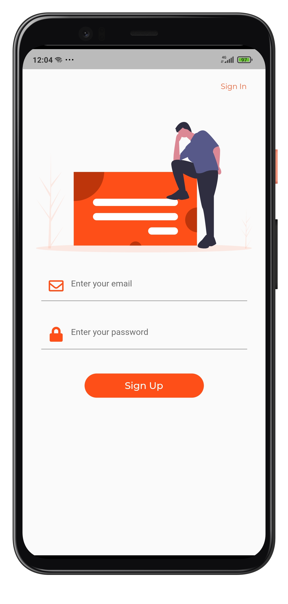
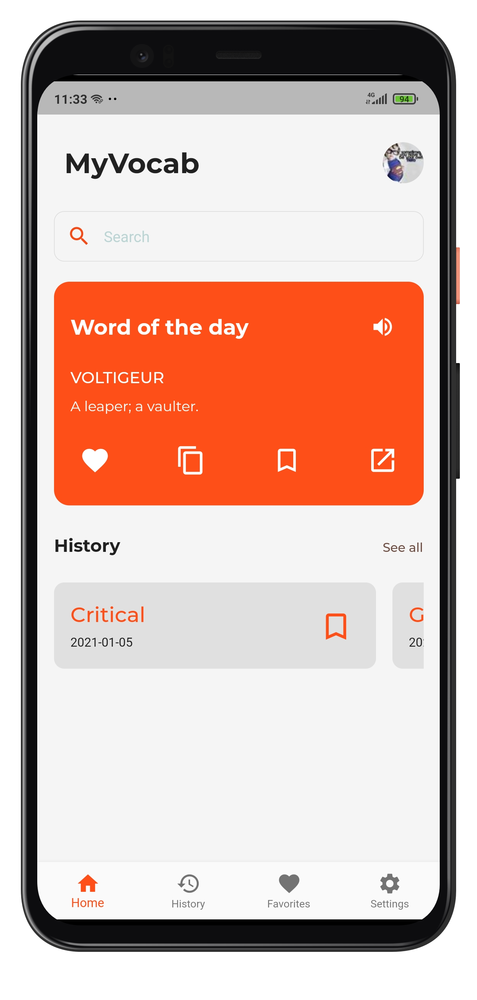
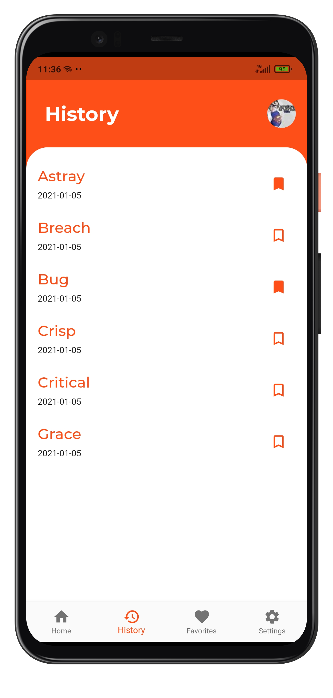
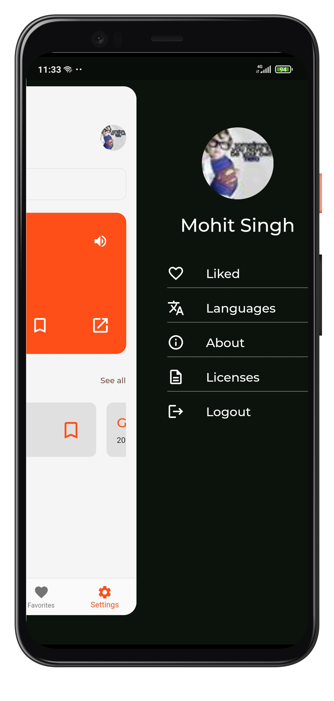
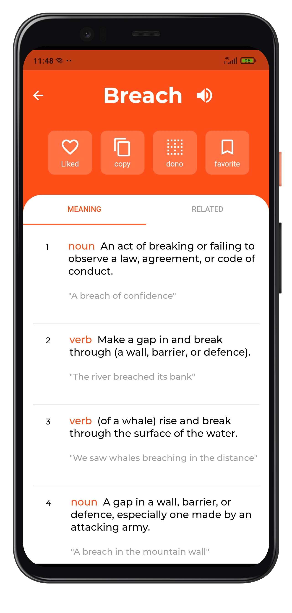

# MyVocab

A Flutter Application to keep track of your vocabulary.

MyVocab uses different APIs for different purposes.

[](https://owlbot.info/)
<br>
[ ](https://developer.wordnik.com/)
<br>
[ ](https://www.datamuse.com/api/)

**Owlbot** This is used to fetch meaning of all searched words.

**Wordnik** This is used to fetch word of the day and audio file for pronunciation of words.

**DataMuse** This is used to fetch search suggestion and related words.

## Getting Started

You can directly install the apk file (present in apk folder) on any android device

## App Screens







#### Building from source

If you do not have the Flutter SDK installed, follow the instructions from the
Flutter site [here](https://flutter.dev/docs/get-started/install).

To build from source clone the repository:

```
git clone https://github.com/MrUnfunny/VocabApp.git
```

Get the dependencies by running this command inside the project directory:

```
flutter packages get
```

Then either run this command to run the app in device:

```
flutter run
```

Or build the apk using this command:

```
flutter build apk
```

This app is tested on Android only.

#### 🔌 Plugins

| Name                                                    | Usage                                               |
| ------------------------------------------------------- | --------------------------------------------------- |
| [**Provider**](https://pub.dev/packages/provider)       | State Management                                    |
| [**Hive**](https://pub.dev/packages/hive)               | NoSQL database to store History & Favorites         |
| [**easy_localization**](https://pub.dev/packages/easy_localization)       | To handle Languages                                |
| [**audioplayers**](https://pub.dev/packages/audioplayers)                 | For pronunciation                    |
| [**flutter_svg**](https://pub.dev/packages/flutter_svg) | To handle vector images inside the app |


#### Contributing

If you have an issue or discover a bug, please raise a GitHub issue. Pull requests are also welcome.

#### Known Issues

* Word of the day cannot be added to favorites
    * This has been done intentionally because word of the day is fetched from wordnik api and other meanings are fetched from owlbot api. Some of wordnik words are not available on owlbot.
* Some search suggested words don't have meaning
    * This is again due to use of two different APIs, datamuse(for search) and owlbot(for meaning). 

In future, I might use a single API for all these purposes. Then, these issues will be fixed.